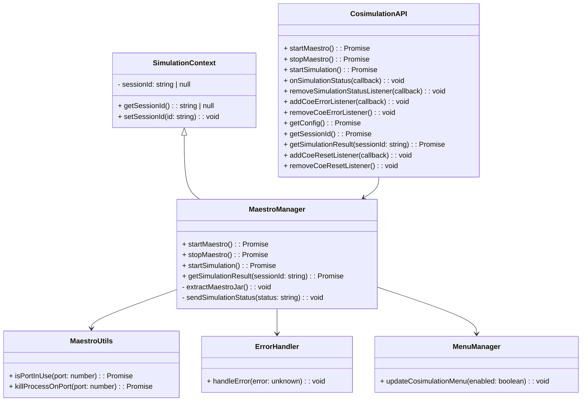
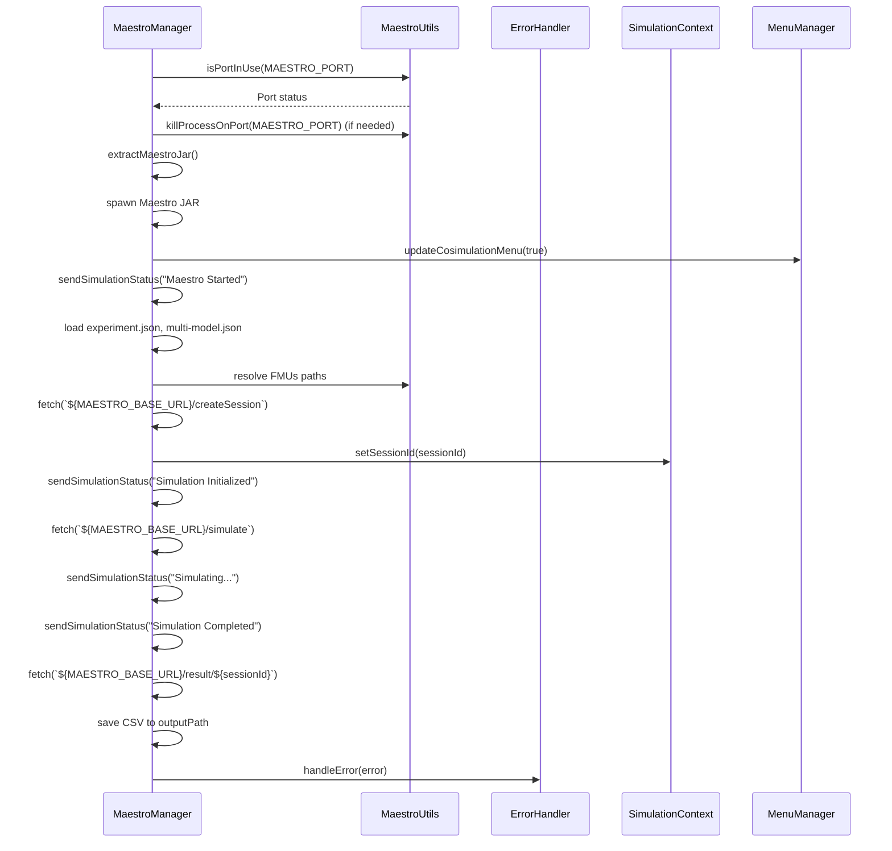
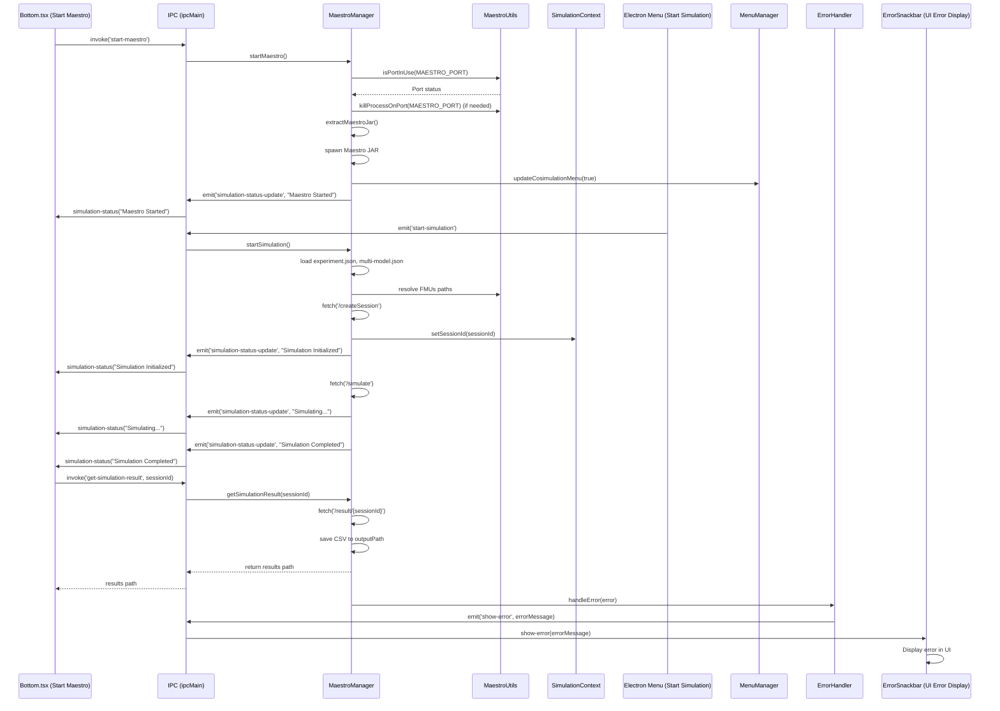

# Overview

This documentaion outlines the key concepts and interaction between the different technologies used to develop the INTO-CPS Application, as well as the logic and the model management.

## Key components

### Electron

Electron is a framework for building desktop applications using JavaScript, HTML, and CSS. By embedding Chromium and Node.js into its binary, Electron allows you to maintain one JavaScript codebase and create cross-platform apps that work on Windows, macOS, and Linux — no native development experience required.[1](https://www.electronjs.org/docs/latest/)

#### BrowserWindow

[BrowserWindow](https://www.electronjs.org/docs/latest/api/browser-window) is a class used to create and manage application windows, displaying HTML, CSS and Javascript content. The class BrowserWindow exposes many API for [Window Customization](https://www.electronjs.org/docs/latest/tutorial/window-customization).\
Each BrowserWindows instance is rendered in its own renderer process, operating differently from the main process.

Example of creation of the main window of the application:

```typescript
mainWindow = new BrowserWindow({
    width: 800,
    height: 600,
    icon: iconPath,
    webPreferences: {
      contextIsolation: true,
      preload: preloadPath,
    },
  });

mainWindow.loadURL(startUrl)
```

##### Processes model and Context management

Electron applications operate with two types of processes:

- Main Process: This manages the whole lifespan of the application, acting as the application's entry point. It runs on a Node.js environment, thus having the ability to use `require`.  This can create windows and interact with the operative system with native APIs. [2](https://www.electronjs.org/docs/latest/tutorial/process-model#the-main-process)
- Renderer Process: Each `BrowserWindow` runs in its own renderer process, responsible for rendering web content (the UI of the application). The renderer has no direct access to Node.js APIs and Electron's native desktop functionality

To securely share information between the main and renderer processes through [**Preload Scripts**](https://www.electronjs.org/docs/latest/tutorial/process-model#preload-scripts) and [**IPC**](https://www.electronjs.org/docs/latest/tutorial/ipc).

##### Preload Scripts

The preload script bridges the main process and the renderer process in a secure manner. It runs in a context that has access to both Node.js and the DOM but does not expose the full Node.js API to the renderer, preventing vulnerabilities for malicious attacks.

Example of `preload.js`:

```typescript
const { contextBridge, ipcRenderer } = require('electron');
contextBridge.exposeInMainWorld('electronAPI', {
  startMaestro: () => ipcRenderer.invoke('start-maestro')
});
```

#### Inter-Process Communication

Electron provides IPC for communication between the main process and renderer processes. IPC helps manage the context by sending and receiving messages, allowing synchronized application states. IPC is the only way to perform many common tasks, such as calling a native API from the UI or triggering changes in the web contents from native menus.
Processes communicate by passing messages through `ipcMain` and `ipcRenderer` modules.

Example of IPC usage for the main process:

```typescript
ipcMain.handle('start-maestro', startMaestro);
```

Example of IPC usage for the renderer process:

```typescript
window?.cosimulationAPI?.startMaestro();
```

### Maestro Management Model

The system is designed to manage the startup of Maestro server and the CoSimulation lifecycle through modular components:

- `MaestroManager`: Controls the CoSimulation lifecycle, allowing to start/stop Maestro, initialize, run and fetch the simulation results.
- `SimulationContext`: Stores and allow to retrieve the current simulation session ID.
- `CosimulationAPI`: Interfaces with MaestroManager to trigger simulation actions (currently focused on backend flow).
- `MaestroUtils`: Provides utilities for managing ports and external processes.
- `ErrorHandler`: Centralized error handling throughout the simulation process.
- `MenuManager`: Manages simulation-related UI state.



The following sequence diagram shows the internal workflow of the MaestroManager during the cosimulation process, covering the startup of the Maestro server, the CoSimulation execution, result handling, and error management



### Maestro Model and UI via IPC interaction

This squence diagram illustrates the interaction between the Maestro Model and the Electron IPC system for managing the CoSimulation process. The process involves starting the maestro server from the `Bottom` bar and running the CosSmulation from the application menu, result handling, and error management.


