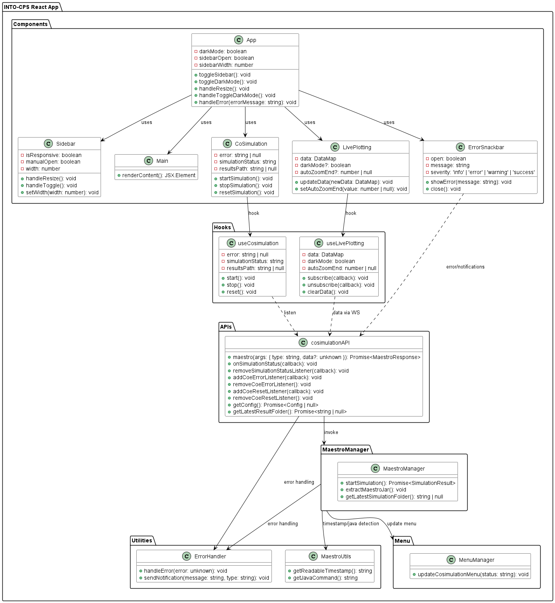
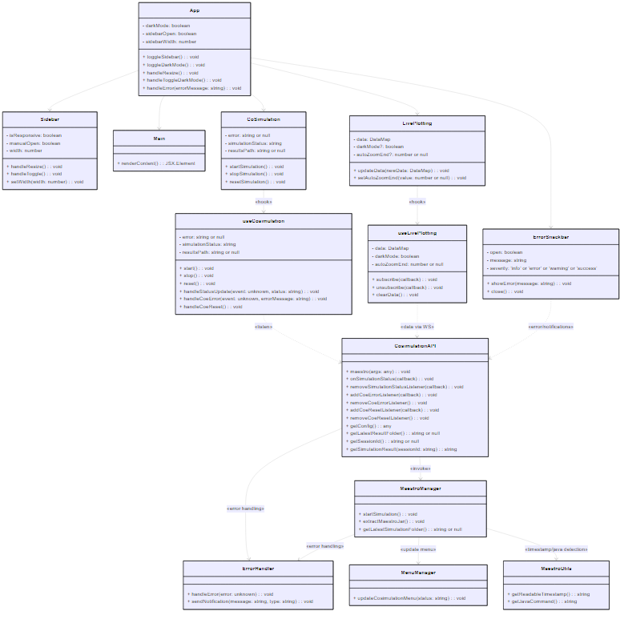
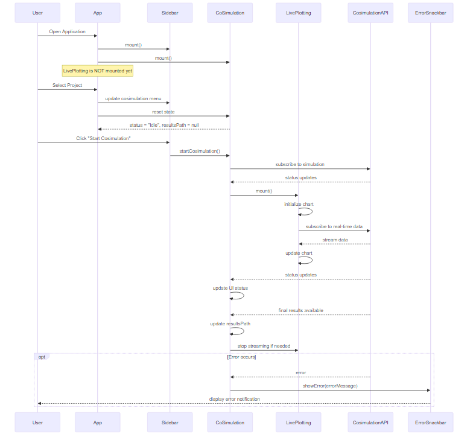
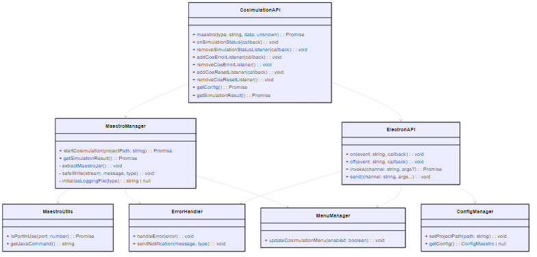
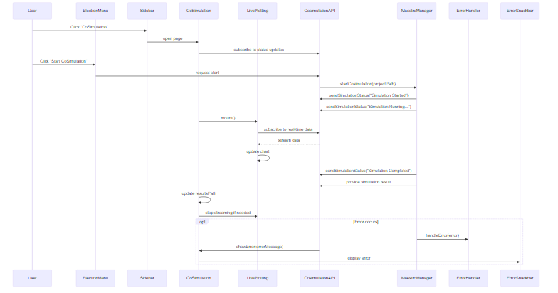
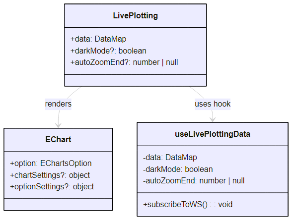
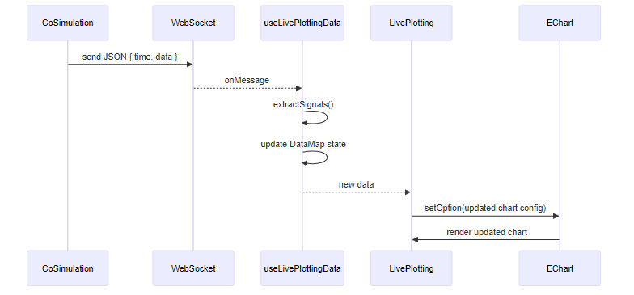
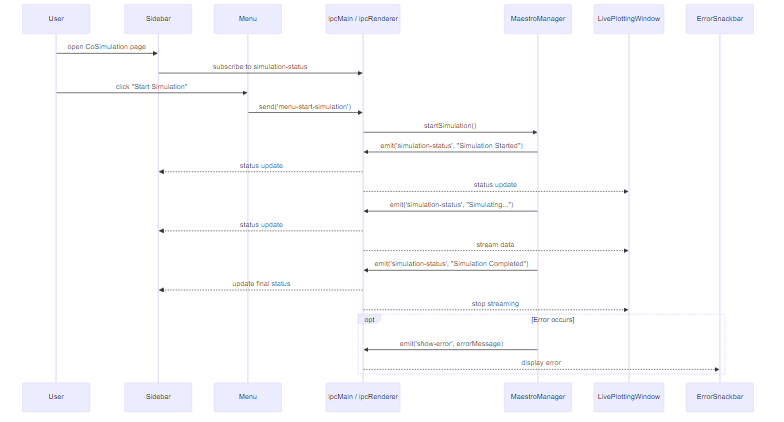

# Overview

This documentaion outlines the key concepts and interaction between the different technologies used to develop the INTO-CPS Application, as well as the logic and the model management.

## Key components

### Electron

Electron is a framework for building desktop applications using JavaScript, HTML, and CSS. By embedding Chromium and Node.js into its binary, Electron allows you to maintain one JavaScript codebase and create cross-platform apps that work on Windows, macOS, and Linux — no native development experience required.[[1]](https://www.electronjs.org/docs/latest/)

#### BrowserWindow

[BrowserWindow](https://www.electronjs.org/docs/latest/api/browser-window) is a class used to create and manage application windows, displaying HTML, CSS and Javascript content. The class BrowserWindow exposes many API for [Window Customization](https://www.electronjs.org/docs/latest/tutorial/window-customization).\
Each BrowserWindows instance is rendered in its own renderer process, operating differently from the main process.

Example of creation of the main window of the application:

```typescript
mainWindow = new BrowserWindow({
    width: 800,
    height: 600,
    icon: iconPath,
    webPreferences: {
      contextIsolation: true,
      preload: preloadPath,
    },
  });

mainWindow.loadURL(startUrl)
```

##### Processes model and Context management

Electron applications operate with two types of processes:

- Main Process: This manages the whole lifespan of the application, acting as the application's entry point. It runs on a Node.js environment, thus having the ability to use `require`.  This can create windows and interact with the operative system with native APIs. [2](https://www.electronjs.org/docs/latest/tutorial/process-model#the-main-process)
- Renderer Process: Each `BrowserWindow` runs in its own renderer process, responsible for rendering web content (the UI of the application). The renderer has no direct access to Node.js APIs and Electron's native desktop functionality

To securely share information between the main and renderer processes through [**Preload Scripts**](https://www.electronjs.org/docs/latest/tutorial/process-model#preload-scripts) and [**IPC**](https://www.electronjs.org/docs/latest/tutorial/ipc).

##### Preload Scripts

The preload script bridges the main process and the renderer process in a secure manner. It runs in a context that has access to both Node.js and the DOM but does not expose the full Node.js API to the renderer, preventing vulnerabilities for malicious attacks.

Example of `preload.js`:

```typescript
import { contextBridge, ipcRenderer } from 'electron';

contextBridge.exposeInMainWorld('electronAPI', {
  sendNotification: (message: string, type: 'success' | 'error' | 'warning' | 'info') => ipcRenderer.send('show-notification', message, type),
  onSimulationStatus: (callback) => ipcRenderer.on('simulation-status', callback),
});
```

#### Inter-Process Communication

Electron provides IPC for communication between the main process and renderer processes. IPC helps manage the context by sending and receiving messages, allowing synchronized application states. IPC is the only way to perform many common tasks, such as calling a native API from the UI or triggering changes in the web contents from native menus.
Processes communicate by passing messages through `ipcMain` and `ipcRenderer` modules.

Example of IPC usage for the main process:

```typescript
ipcMain.on('show-notification', (event, message: string, type) => {
  if (mainWindow?.webContents) {
    mainWindow.webContents.send('show-notification', message, type);
  }
});
```

Example of IPC usage for the renderer process:

```typescript
window.electronAPI.sendNotification('Simulation started', 'success');
```

### React App

The core `App` component initializes the UI for the INTO-CPS Application, manages global states (currently with contexts) and handle the navigation.\
A CoSimulation is run from the application menu using the `CoSimulationApi`. The `CoSimulation.tsx` component displays simulation statuses and results path using the `useCosimulation` hook, which makes use of `CoSimulationApi`.\
Error —and warnings— handling is managed by `ErrorSnackbar.tsx`, which is being triggered and updated at each error captured, and displayed in a notification at the bottom right of the application main window.

#### Package Diagram



#### Class Diagram



#### Sequence Diagram



### Maestro Management Model

The system manages the Maestro server and CoSimulation lifecycle through modular components:
UI Layer

- `App`: Main component, initializes the UI, handles global state, navigation, and error delegation.
- `CoSimulation`: Displays simulation status and results; interacts with useCosimulation hook.
- `LivePlotting`: Shows real-time simulation data.
- `ErrorSnackbar`: Displays errors and warnings triggered from hooks or API events.

Hooks

- `useCosimulation`: Tracks simulation status, errors, results; communicates with CosimulationAPI.
- `useLivePlotting`: Manages real-time data subscriptions for LivePlotting.

API Layer

- `CosimulationAPI`: Bridges frontend hooks/components with MaestroManager, emitting simulation events and fetching results.

Backend and Utilities

- `MaestroManager`: Runs simulations, fetches results, updates MenuManager.
- `MaestroUtils`: Provides helpers like timestamp and Java detection.
- `MenuManager`: Updates simulation-related UI controls.
- `ErrorHandler`: Centralized error management.



The following sequence diagram shows the internal workflow of the MaestroManager during the cosimulation process, covering the CoSimulation execution, result handling, and error management



### Live Plotting Feature

The Live Plotting feature provides real-time visualization of the CoSimulation data. It is fully integrated to the application via React hooks and it makes usage of the [ECharts](https://echarts.apache.org/en/index.html) native library, while being launched in another window and operating independently from the rest of the application.

#### Key Components & Responsibilities

##### LivePlotting.tsx

This is the component displaying a full-screen chart. It shows the graph drawn by the `EChart` component as a wrapper for the ECharts library. Live updates are independent from the simulation page (CoSimulation).

Updates chart options whenever `data`, `darkMode`, or `autoZoomEnd` changes.

- `data`: a DataMap object containing signal arrays { [signalName]: [{time, value}] }.
- `darkMode`: optional, switches chart theme.
- `autoZoomEnd`: optional, controls automatic zooming to the end of the data.

##### EChart.tsx

React wrapper for the native ECharts library. This initialiazes the chart and allows for the dynamic resizing of it.

##### useLivePlotting.ts

This provides hooks for managing real-time data updates. Data extraction is done using `extractSignals()`, which flattens nested objects to simple `{ path: value }` key-value pairs.\
WebSocket subscription: `useLivePlottingData()` connects to a WS server (default `ws://localhost:8085`) and updates state whenever a new message arrives. It maintains a maximum of `MAX_POINTS` points per signal, supports automatic reconnection with retry logic (`createWebSocketWithRetry`) and chart options generation: `getChartOption()` produces dynamic `ECharts` configuration based on current data, dark mode, and auto-zoom state.

#### Data Flow

- CoSimulation (Maestro) streams real-time signal data via WebSocket.
- `useLivePlottingData()` parses the data and updates data state.
- `LivePlotting.tsx` observes changes to data and renders the chart using the `EChart` wrapper to draw it.
- Optional auto-zoom ensures the chart scrolls as new data arrives and allows the user to move the graph and visualize data better.





#### Logging Features & File Monitoring

Single log file per cosimulation session:

- Format: `CoSimulation-<timestamp>.log`
- Timestamp format: `YYYY-MM-DD_HH-MM-SS` (human-readable, generated via `getReadableTimestamp()`)
- Location: `results/cosimulation/default/logs`

Lifecycle:

- At cosimulation start, a new log file is created.
- All simulation messages (status, errors, events) are appended to this file.
- Upon completion, the log file contains a full record of the session.

```ts
export function getReadableTimestamp(): string {
  const now = new Date();
  return now.toISOString().replace(/T/, '_').replace(/:/g, '-').replace(/\..+/, '');
}
```

#### Java Configuration

The application safely resolves the system’s default Java path with `getJavaCommand()`, compatible with update-alternatives and avoids relying on tools like sdkman that might not be active when running `.AppImage` GUIs, as the `.AppImage` might fail to locate it. The system now detects the default Java executable via `which java` (Linux/macOS) or `where java` (Windows).

### Maestro Model and React communication using IPC

The interaction between the React frontend and the Electron logic is **exclusively** being managed through IPC.

When a user interacts with the application, the React frontend calls methods exposed through `window.cosimulationAPI` or `window.electronAPI`. These API's work as a secure bridge between the frontend and the Electron logic.\
Actions such as `startMaestro` function are triggered via IPC events, ensuring a secure bridge between frontend and Electron logic.\
The user interface receives real-time feedback thanks to the emitted statuses from the backend, like `simulation-status-update`, captured by the hook `useCosimulation`, which updates the UI.

The following squence diagram illustrates the interaction between the Maestro Model and the Electron IPC system for managing the CoSimulation process.

- The user opens the `CoSimulation` page from the Sidebar → subscribes to status updates via IPC.
- The user starts the simulation from the `Menu` → menu sends `menu-start-simulation` via IPC → `ipcMain` → `MaestroManager`.
- `MaestroManager` manages all simulation logic, sends updates via simulation-status to relevant renderers (main window, live plotting window).
- Any errors are handled by `ErrorHandler` → IPC → `ErrorSnackbar`.


