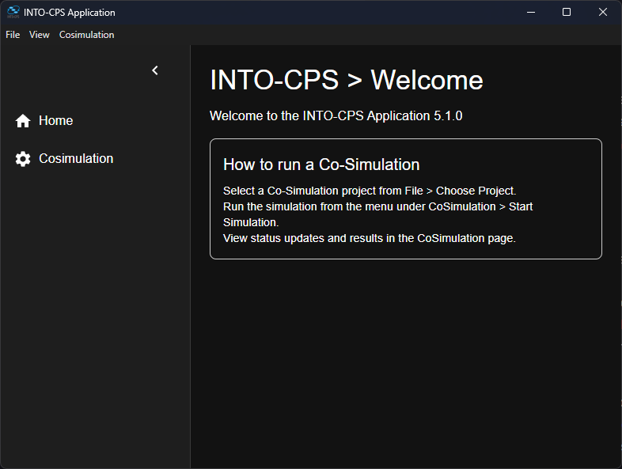

# User Guide

Welcome to the **INTO-CPS Application** User Guide.\
This guide provides step-by-step instructions to configure and run a Co-Simulation using the Maestro Engine.\
The guide is structured as follow:

- [Required dependencies](#required-dependencies): Necessary requirements to run Maestro.
- [Project configuration](#project-configuration): Correct project directory configuration before launching Maestro and running a simulation.
- [Application overview](#application-overview): Understand the main components of the interface and the application's functionalities.
- [Using the Application](#using-the-application): How to select a project, start the engine, run a simulation, retrieve the results, and stop Maestro.
- [Troubleshooting](#troubleshooting): Solutions to common issues.

## Required dependencies

You need to ensure that Java is installed in your system in order to use the application. At the current state, Java 8.x.x or Java 11.x.x are required to properly use Maestro.\
To manage different versions of Java on Linux, `update-alternatives` is recommended, as other tools like `SDKMan` may configure the Java path only in the shell environment and can lead to issues when launching `.AppImage` GUIs without a terminal.

```bash
sudo update-alternatives --install /usr/bin/java java /usr/lib/jvm/java-11-openjdk-amd64/bin/java 1
sudo update-alternatives --set java /usr/lib/jvm/java-11-openjdk-amd64/bin/java
```

### Project configuration

To start the Maestro Co-Simulation Engine, a proper Co-Simulation project has to be configured.\
It is necessary to have a folder with the following structure:

```plaintext
FMUs/
  FMU1
  FMU2
  ...

cosimulation/
  default/ (plain co-simulation config with separate multi-models and experiment configurations)
    multi-model.json
    experiment.json

results/
  cosimulation (same structure as top-level cosimulation, according to your cosimulation project)
```

## Application overview

After launching the application, the application opens to the main page.\
The application consists of four main parts: the main content area, the sidebar, the bottom bar and the top menu.



### Features

- Toggle Dark Mode
- Toggle Developer Mode
- Select Co-Simulation project
- Co-Simulation:
  - Run Co-Simulation
  - Retrieve the Co-Simulation results
  
## Using the Application

### Important Notes

If prompted by Windows Firewall, it is recommended to allow access: if denied, Maestro may not execute properly.

Ensure that the port 8082 and WebSocket port 8085 are open on your system, otherwise the application may not communicate properly with the Maestro Engine.

### Selecting a project

To run Maestro, a Co-Simulation project is required:

- Click on "File" → "Choose Project" from the top menu.
- A dialog box will appear. Select the folder containing your project and confirm.
- The application will load the selected project and enable the co-simulation menu.
Please be sure to have the exact same project folder structure described before.

### Running the Co-Simulation

- Click "Start Simulation" in the top menu under "CoSimulation"
- The application will:
  - Load the project, including the experiment and multi-model configurations.
  - Resolve the paths for FMUs and initialize the session.
  - Display the simulation statuses updates:
    - "Simulation Initialized"
    - "Simulating..."
  - If errors occur, they will be shown in the error snackbar at the bottom right.

Note: If you try to run a simulation while another one is still in progress, the application will block the request and show a warning. This prevents unexpected behavior or data corruption.

### Retrieving the results

- Once the simulation is completed, the results will be saved.
- The CoSimulation page will show:
  - Simulation status "Simulation Completed"
  - The path of the folder containing your results
- If errors occur, they will be shown in the error snackbar at the bottom right.

### Simulation Logs and Timestamps

Each simulation automatically generates a dedicated log file under:

```plaintext
results/cosimulation/default/logs
```

Files are named with a readable timestamp, e.g. `CoSimulation-2025-03-22_12-35-10.log`.

Logs include simulation steps, errors, and result statuses. If the log file is deleted during runtime, the app will detect this and notify the user, but the CoSimulation will keep running. To generate again a Maestro or CoSimulation log, restart Maestro or run another CoSimulation.

## Troubleshooting

- Maestro doesn't start?\
  Maestro is automatically installed with the application and the only dependency needed is Java. Ensure that Java is installed and properly configured, then restart the application.
- Maestro gets stuck at `Starting Maestro`? Check if you are using the correct Java version.
