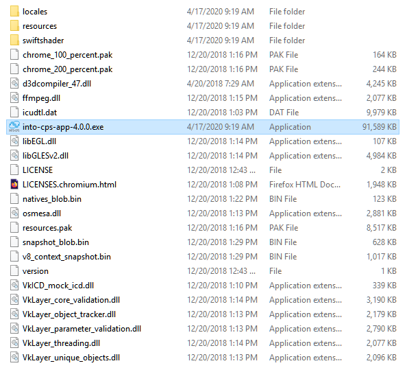
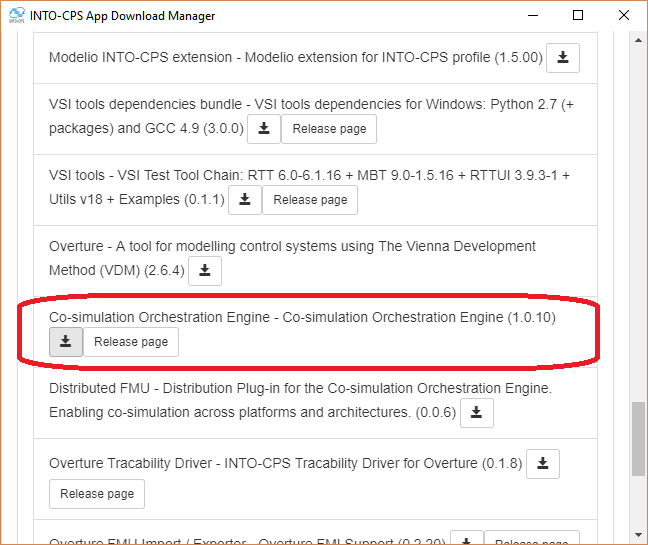

First Steps
===========

The following sections guides you through the process of installing the application, installing its dependencies and finally demonstrates how a co-simulation can be configured and executed within the application.

Install the application
-----------------------

There are two options for installing the application. 
The recommended approach is to download the latest `Release Build`_, which is may lack bleeding edge features, but is typically much more stable.
The alternative, is building the latest `Development Build`_ from source, which gives access to the most recently added features, but at a potential cost of stability.

Release Build
^^^^^^^^^^^^^^
The latest release of the application for Windows, Linux, and macOS can be found on  `GitHub Releases <https://github.com/INTO-CPS-Association/into-cps-application/releases>`__.
Download and extract the zip archive corresponding to your host architecture.
The extracted directory should look similar to this:

Development Build
^^^^^^^^^^^^^^^^^

1. clone the repository: ``git clone https://github.com/INTO-CPS-Association/into-cps-application/tree/development``
2. change working directory to repository: ``cd into-cps-application``
3. install node dependencies: ``npm install``
4. install other resources: ``gulp init``
5. build ui: ``gulp`` 
6. run the test: ``npm test``

Installing toolchain dependencies
---------------------------------

The application is modular by design, as such it relies on external programs to support its features.
The easiest way to install these is using the built in download manager.

1. Start the application by executing the program ``into-cps-app-x.x.x``
2. Press the "Window.Show Download Manager" tab, a window will appear
3. Select the latest version of the toolchain
4. Select and download "Co-simulation Orchestration Engine - Co-simulation"

.. note::
    This guide only installs the dependency necessary to perform co-simulations inside the application.
    To access other features it may be necessary to install additional programs.

Performing a Co-Simulation
--------------------------

.. warning::
    Missing!
    Here we should explain how to run, say the water tank example.