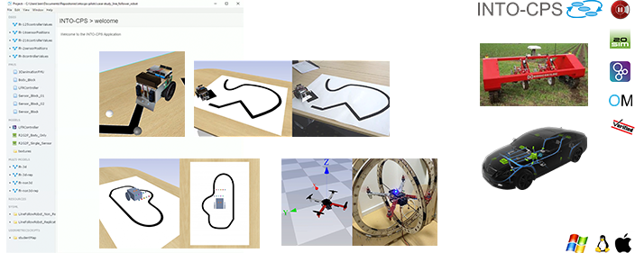

INTO-CPS Desktop Application
============================

Welcome to the INTO-CPS Desktop Application documentation.
The best way to get started is to follow the :ref:`First Steps` guide which guides you thorugh the installation process and the basics of the application. 

For a guide on how to use the various features of the application :ref:`User Interface` provides an overview of how to access the most important functionality. 

.. toctree::
    :maxdepth: 2
    :caption: Content
    :hidden:
    
    first_steps
    interface
    tutorials
    developer_documentation