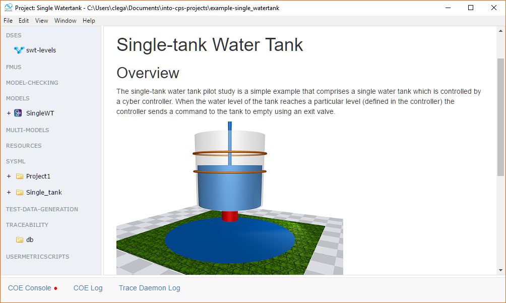

INTO-CPS Desktop Application
============================
Welcome to the INTO-CPS Desktop Application documentation.
The best way to get started is to follow the :ref:`first_steps` guide which guides you thorugh the installation process and the basics of the application. 

For a guide on how to use the various features of the application :ref:`user_interface` provides an overview of how to access the most important functionality.

.. note::
    The INTO-CPS Toolchain refers to a collection of programs not limited to the the desktop application.
    For an comprehensive overview of all tools take a look at the `INTO-CPS toolchain documentation <https://into-cps-association.readthedocs.io/en/latest/>`__

.. toctree::
    :maxdepth: 2
    :caption: Content
    :hidden:
    
    first_steps
    interface
    integrations
    tutorials
    developer_documentation