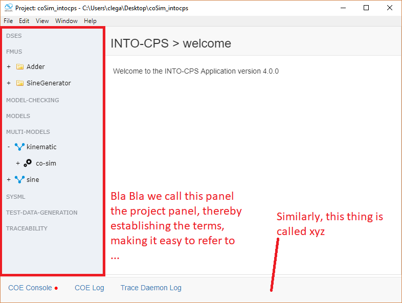

.. _user_interface:

User Interface
==============

The INTO-CPS Application is the front-end of the INTO-CPS tool chain. The following screenshot shows how it looks.

.. warning::
    Here we should explain in simple terms how to use the application.
    Important concepts such as multimodel-config and co-simulation configuration should be explained!

    Additionally, a video demonstation would go a long way

    Also we need need to consider what we are trying to convey. For example what information does the old docs convey:
    
    ::

        The app is composed of 2 primary views: On the left, the project browser left is always visible. It shows the various components of an INTO-CPS project. These components can be clicked to trigger various actions. 
        In the center, the main view is shown. The contents of this view depend on which action has been trigerred in the project browser. A few example views are shown below.

Overview
--------
The app is composed of 2 primary views: On the left, the project browser left is always visible. It shows the various components of an INTO-CPS project. These components can be clicked to trigger various actions. 
In the center, the main view is shown. The contents of this view depend on which action has been trigerred in the project browser. A few example views are shown below.

Important Functionality
-----------------------

.. warning::
    here we should describe how to use the various components of the application

.. _download_manager:

Download Manager
^^^^^^^^^^^^^^^^

Example Projects
^^^^^^^^^^^^^^^^

Plotting
^^^^^^^^

Design-Space Exploration
^^^^^^^^^^^^^^^^^^^^^^^^

